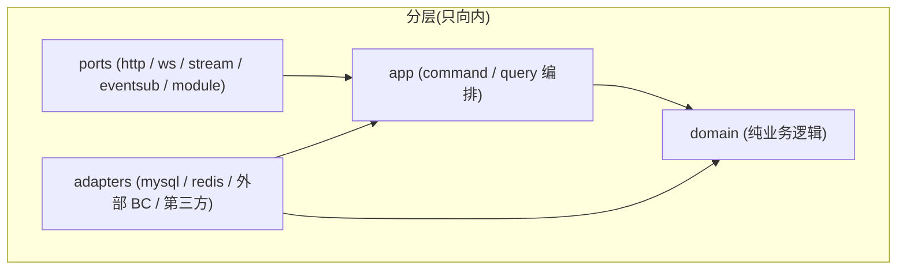
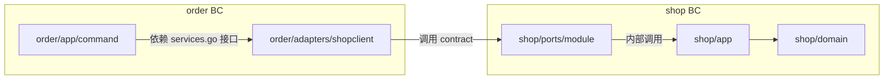

# 核心架构

本文档定义项目的分层、目录结构、各层职责和 import 规则。

跨 BC 通信、命名规约、测试策略、反例分别见独立文档:

- [跨 BC 通信](./cross-context.md)
- [命名规约](./naming.md)
- [测试组织](./testing.md)
- [反例集合](./anti-patterns.md)

---

## 1. 设计目标

1. **业务复杂度可控**:用 DDD Lite 把领域逻辑、用例编排、外部依赖分层,各司其职
2. **演进友好**:任何 Bounded Context(下称 BC)能在不改 app / domain 的前提下拆为独立服务
3. **跨 BC 边界清晰**:BC 之间只能通过明确契约通信(同步走 Module Contract,异步走 Integration Event,读模型走本地物化视图),不允许直接 import 对方的 domain / app / adapters
4. **可测试**:每一层都能独立测试,不依赖运行环境
5. **统一规范**:目录结构、命名、错误处理在所有 BC 内保持一致

## 2. 核心理念

### 2.1 分层与依赖方向



**铁规则**:**内层永远不 import 外层**。

- domain 不知道 app 的存在
- app 不知道 ports / adapters 的存在
- 跨 BC 通信只走三种合法方式:同步 Module Contract(`ports/module/`)、异步 Integration Event(`platform/eventbus`)、本地物化视图;详见 [`cross-context.md`](./cross-context.md)

### 2.2 跨 Bounded Context 调用链路



- `order/app/command/services.go` 定义本 BC 视角的最小接口(如 `ProductsService`)
- `order/adapters/shopclient/` 实现该接口,内部 import 并调用 `shop/ports/module/`
- **order 只允许 import `shop/ports/module/`**,不允许 import shop 的 domain / app / adapters

## 3. 完整目录结构

```text
myshop/
├── cmd/
│   └── main.go                              # 极薄启动入口
│
├── internal/
│   ├── bootstrap/                           # 进程级 Composition Root(只做编排)
│   │   └── server.go                        # 打开技术底座 + 实例化各 BC module + 跨 BC wiring
│   │
│   ├── order/                               # Bounded Context: 订单
│   │   ├── module.go                        # BC-level Composition Root:NewModule(Deps) (*Module, error)
│   │   │
│   │   ├── domain/
│   │   │   └── order/                       # 一个聚合一个子包
│   │   │       ├── order.go                 # Aggregate Root + 业务方法
│   │   │       ├── item.go                  # Entity / Value Object
│   │   │       ├── status.go                # 枚举
│   │   │       ├── repository.go            # Repository 接口
│   │   │       ├── events.go                # 该聚合的 Domain Event
│   │   │       └── errors.go                # 领域错误
│   │   │
│   │   ├── app/
│   │   │   ├── app.go                       # Application{Commands, Queries}
│   │   │   ├── command/
│   │   │   │   ├── services.go              # 外部能力最小接口
│   │   │   │   ├── place_order.go
│   │   │   │   └── cancel_order.go
│   │   │   └── query/
│   │   │       ├── types.go                 # query DTO
│   │   │       ├── read_model.go            # ReadModel 接口(供 adapters 实现)
│   │   │       ├── get_order.go
│   │   │       └── list_orders.go
│   │   │
│   │   ├── ports/
│   │   │   ├── http/
│   │   │   │   ├── router.go
│   │   │   │   └── order_handler.go
│   │   │   ├── eventsub/                    # 订阅其他 BC 的 integration events
│   │   │   │   └── payment_confirmed_handler.go
│   │   │   └── module/
│   │   │       ├── contract.go              # OrderModule 接口 + 实现
│   │   │       ├── events.go                # 对外发布的 Integration Event 定义
│   │   │       └── types.go                 # Transport DTO
│   │   │
│   │   └── adapters/
│   │       ├── mysql/
│   │       │   ├── order_repository.go      # domain Repository 实现
│   │       │   ├── uow.go                   # 本 BC 的 UnitOfWork 薄包装
│   │       │   └── order_read_model.go      # app/query ReadModel 实现
│   │       └── shopclient/                  # 调用 shop BC 的 module contract
│   │           └── products_service.go      # 实现 app/command 的 ProductsService
│   │
│   ├── shop/                                # Bounded Context: 商品
│   │   ├── module.go
│   │   ├── domain/
│   │   │   └── product/
│   │   │       ├── product.go
│   │   │       ├── repository.go
│   │   │       ├── events.go
│   │   │       └── errors.go
│   │   ├── app/
│   │   │   ├── app.go
│   │   │   ├── command/
│   │   │   │   └── create_product.go
│   │   │   └── query/
│   │   │       ├── types.go
│   │   │       ├── read_model.go
│   │   │       ├── get_product.go
│   │   │       └── list_products.go
│   │   ├── ports/
│   │   │   ├── http/
│   │   │   │   ├── router.go
│   │   │   │   └── product_handler.go
│   │   │   └── module/
│   │   │       ├── contract.go
│   │   │       ├── events.go
│   │   │       └── types.go
│   │   └── adapters/
│   │       └── mysql/
│   │           ├── product_repository.go
│   │           └── product_read_model.go
│   │
│   ├── payments/                            # Bounded Context: 支付
│   │   ├── module.go
│   │   ├── domain/
│   │   │   └── payment/
│   │   │       ├── payment.go
│   │   │       ├── repository.go
│   │   │       ├── events.go
│   │   │       └── errors.go
│   │   ├── app/
│   │   │   ├── app.go
│   │   │   ├── command/
│   │   │   │   ├── services.go              # 外部支付网关接口
│   │   │   │   ├── initialize_payment.go
│   │   │   │   └── confirm_payment.go
│   │   │   └── query/
│   │   │       ├── types.go
│   │   │       ├── read_model.go
│   │   │       └── get_payment.go
│   │   ├── ports/
│   │   │   ├── http/
│   │   │   │   └── payment_handler.go
│   │   │   ├── stream/                      # 第三方 MQ 消费(如 Stripe webhook 走 MQ)
│   │   │   │   └── stripe_webhook_consumer.go
│   │   │   ├── eventsub/                    # 订阅本进程内 BC 的 integration events
│   │   │   │   └── order_placed_handler.go
│   │   │   └── module/
│   │   │       ├── contract.go
│   │   │       ├── events.go
│   │   │       └── types.go
│   │   └── adapters/
│   │       ├── mysql/
│   │       │   └── payment_repository.go
│   │       └── stripe/
│   │           └── client.go                # 实现 services.go 的支付网关接口
│   │
│   ├── shared/                              # 跨 BC 共享业务原语(值类型 + 纯函数)
│   │   ├── bizerr/
│   │   │   └── error.go
│   │   └── money.go
│   │
│   └── platform/                            # 技术底座(与业务无关)
│       ├── config/
│       ├── mysql/
│       ├── redis/
│       ├── eventbus/                        # 进程内事件总线
│       ├── httpserver/
│       │   ├── server.go
│       │   └── middleware.go                # 通用中间件:auth/log/trace/recover
│       ├── logging/
│       ├── dbtx/                           # 泛型 RunInTx 模板、PendingCollector
│       └── txerr/                           # CommitOutcomeUnknownError、PostCommitPublishError
│
├── go.mod
└── go.sum
```

> 不使用 `pkg/`。所有代码在 `internal/`,避免给外部 import 留口子。

## 4. 各目录职责

### 4.1 `cmd/main.go`

- 极薄入口:加载配置 → 调 `bootstrap.Run(cfg)` → 等待信号
- 不做任何组装逻辑
- 不超过 50 行

### 4.2 两层 Composition Root

装配责任分两层,各管各的:

| 层 | 位置 | 职责 |
|---|---|---|
| **BC-level** | `internal/{bc}/module.go` | 装配本 BC 内部所有部件 |
| **Process-level** | `internal/bootstrap/server.go` | 进程级编排:技术底座 + 选择 BC + 跨 BC wiring |

#### 4.2.1 `internal/{bc}/module.go` — BC-level Composition Root

每个 BC 都拥有自己的装配工厂。文件位于 BC 根目录,包名就是 BC 名(如 `package order`)。

职责:

- 装配本 BC 的 domain repository、ReadModel、app Handler、ports(http router、eventsub、`ports/module` 实例)、**只依赖技术底座的 BC 内部 adapter**(如 `adapters/mysql/`、`adapters/redis/`)
- 通过 `Deps` 结构体**显式声明**需要外部注入的依赖(技术底座 + **本 BC 视角的跨 BC 接口** + 横切能力)
- 通过 `Module` 结构体**显式暴露**对外接入点(HTTP router、`ports/module` 实例、需要订阅的 event handlers 等)

**禁止做的事**:

- **不**打开 DB / Redis / HTTP server(那是 platform / bootstrap 的责任)
- **不** import **任何**其他 BC 的包,**包括对方的 `ports/module/`**——跨 BC 依赖必须以本 BC 自己定义的接口形态从 `Deps` 注入
- **不** new 跨 BC adapter(如 `shopclient`),由 bootstrap 实例化后通过 `Deps` 注入
- **不**依赖 bootstrap 的任何包

> **为什么 `module.go` 不能 import 对方的 `ports/module/`**:Go `internal/` 包边界规则下,等到本 BC 被剥离到独立仓库时,原跨仓库的 `internal` 路径将不再可 import,真正想拆服务时会被这一行 import 卡住。把跨 BC 依赖**反转为本 BC 自己定义的接口**,`module.go` 才能真正做到"剥离零变更"。

最小样板:

```go
// internal/order/module.go
package order

import (
    "context"
    "database/sql"
    "log/slog"
    "net/http"

    "myshop/internal/order/adapters/mysql"
    "myshop/internal/order/app"
    "myshop/internal/order/app/command"
    "myshop/internal/order/app/query"
    "myshop/internal/order/ports/eventsub"
    orderhttp "myshop/internal/order/ports/http"
    ordermod  "myshop/internal/order/ports/module"
    "myshop/internal/platform/clock"
    "myshop/internal/platform/eventbus"
    "myshop/internal/platform/idgen"
)

type Deps struct {
    // 基础设施句柄(具体类型即可,这是 Go 工程实践)
    DB       *sql.DB
    Logger   *slog.Logger // 已是结构化日志句柄,无需再抽象
    EventBus eventbus.Bus // 本身是接口(平台抽象)

    // 横切能力(接口,便于测试与替换)
    Clock clock.Clock
    IDGen idgen.IDGen

    // 跨 BC 依赖(必须是本 BC 自己定义的接口)
    Products command.ProductsService // 来自本 BC 的 app/command/services.go
}

type Module struct {
    App         *app.Application
    HTTPRouter  http.Handler
    PortsModule ordermod.OrderModule
    EventSubs   []eventbus.Subscription
}

func NewModule(deps Deps) (*Module, error) {
    orderRepo := mysql.NewOrderRepository(deps.DB, deps.IDGen)
    orderUoW  := mysql.NewUnitOfWork(deps.DB, mysql.Deps{
        EventBus: deps.EventBus,
        IDGen:    deps.IDGen,
        Logger:   deps.Logger,
    })
    orderRM   := mysql.NewOrderReadModel(deps.DB)

    application := &app.Application{
        Commands: app.Commands{
            PlaceOrder: command.PlaceOrderHandler{
                Orders:   orderRepo,
                UoW:      orderUoW,        // 多聚合 command 才使用;单聚合路径仍可直接调 Orders.Save
                Products: deps.Products,   // 直接用 Deps 注入的接口
                Clock:    deps.Clock,
            },
            // ...
        },
        Queries: app.Queries{
            GetOrder: query.GetOrderHandler{ReadModel: orderRM},
            // ...
        },
    }

    return &Module{
        App:         application,
        HTTPRouter:  orderhttp.NewRouter(application),
        PortsModule: ordermod.NewOrderModule(application),
        EventSubs:   eventsub.All(application),
    }, nil
}
```

#### 4.2.2 跨 BC adapter 的归属与装配责任

`internal/order/adapters/shopclient/` 这一类"跨 BC adapter"是个特殊角色:

- 它**实现 order 自己定义的接口**(`command.ProductsService`)——所以它在物理上放在 order 仓库下
- 它**依赖另一个 BC 的能力**(在 monolith 阶段是 `shopmod.ShopModule`)——所以 `order.NewModule` 不能 new 它(否则 module.go 就要 import shop)
- 它代表"两个 BC 间的胶水",**由 bootstrap 实例化并通过 `Deps` 注入** order.NewModule

不同形态的 adapter:

| Adapter | 谁实例化 | 拆服务时 |
|---|---|---|
| `adapters/mysql/`(只依赖 DB) | `order.NewModule` | 跟着 order 走,几乎不动 |
| `adapters/stripe/`(只依赖外部 API) | `order.NewModule` | 跟着 order 走,几乎不动 |
| `adapters/shopclient/`(依赖另一个 BC) | **bootstrap** | **被替换**为 `adapters/shophttp/`(远程 RPC 实现)|

这就是为什么"BC 整体零变更"的精确范围是 `domain/ + app/ + ports/ + module.go + 仅依赖技术底座的 adapter`,而跨 BC adapter 本就是 hexagonal 模式中"被变化"的层(详见 §7)。

#### 4.2.3 `internal/bootstrap/` — Process-level Composition Root

只做"进程级编排",**不**包含任何 BC 内部装配细节。

职责:

- 加载 config
- 打开技术底座:logger / MySQL / Redis / eventbus / HTTP server
- 按启动参数(或配置)决定本进程运行哪些 BC
- **按依赖顺序**实例化各 BC 的 `Module`
- **实例化跨 BC adapter**(如 `shopclient.NewProductsService(shopMod.PortsModule)`),把它作为 order 的 `Deps.Products` 注入
- 把各 BC 暴露的 `HTTPRouter` 挂到 HTTP server
- 把各 BC 的 `EventSubs` 注册到 eventbus
- 统一 graceful shutdown

最小样板:

```go
// internal/bootstrap/server.go
package bootstrap

import (
    "myshop/internal/order"
    orderadapters "myshop/internal/order/adapters/shopclient" // 跨 BC adapter
    "myshop/internal/payments"
    paymentsadapters "myshop/internal/payments/adapters/orderclient"
    "myshop/internal/shop"
    "myshop/internal/platform/..."
)

func Run(ctx context.Context, cfg config.Config) error {
    log := logging.New(cfg.Logging)
    db  := mysql.MustOpen(cfg.MySQL)
    eb  := eventbus.NewInMemory() // 单进程实现,见 §7 演进路径

    // 1. 装配没有跨 BC 依赖的 BC
    shopMod, err := shop.NewModule(shop.Deps{
        DB: db, EventBus: eb, Logger: log,
    })
    if err != nil { return err }

    // 2. 装配跨 BC adapter(bootstrap 是唯一知道两个 BC 同时存在的地方)
    productsService := orderadapters.NewProductsService(shopMod.PortsModule)

    // 3. 装配依赖 shop 的 BC,通过 order 自己的接口注入
    orderMod, err := order.NewModule(order.Deps{
        DB: db, EventBus: eb, Logger: log,
        Products: productsService, // 已是 order 自己的接口类型
    })
    if err != nil { return err }

    ordersClient := paymentsadapters.NewOrdersService(orderMod.PortsModule)
    paymentsMod, err := payments.NewModule(payments.Deps{
        DB: db, EventBus: eb, Logger: log,
        Orders: ordersClient,
    })
    if err != nil { return err }

    // 4. 挂 HTTP
    srv := httpserver.New(cfg.HTTP)
    srv.Mount("/orders",   orderMod.HTTPRouter)
    srv.Mount("/products", shopMod.HTTPRouter)
    srv.Mount("/payments", paymentsMod.HTTPRouter)

    // 5. 注册 event subscriptions
    for _, sub := range slices.Concat(orderMod.EventSubs, shopMod.EventSubs, paymentsMod.EventSubs) {
        sub.Register(eb)
    }

    return srv.Run(ctx)
}
```

**关键约束**:

- bootstrap 允许 import:**各 BC 根包** + **各 BC 的跨 BC adapter 包**(`{bc}/adapters/{other_bc}client/`) + `platform/`
- bootstrap **不能** import:各 BC 的 domain / app / ports / 其他 adapter
- 业务代码**绝不** import bootstrap
- 跨 BC wiring 集中在 bootstrap 一处,搜 `NewModule(` 一眼看清依赖图

### 4.3 `internal/{bc}/domain/` — 领域层

**纯业务逻辑**,零外部依赖。

- 一个聚合一个子包:`domain/order/`、`domain/product/`、`domain/payment/`
- 每个子包内容:
  - **Aggregate Root**:私有字段 + 业务方法,字段全部小写,不导出
  - **Entity / Value Object**:同样收敛构造与不变量
  - **Repository 接口**:聚合持久化契约,接收 `context.Context`,返回 typed error
  - **Domain Event**:本聚合产生的事件,在 `events.go`
  - **typed errors**:`var ErrNotFound = errors.New(...)`,放 `errors.go`
- 构造与恢复分离:
  - `NewOrder(...)`:做**全量不变量校验**,创建新聚合
  - `Rehydrate(...)`:**仅恢复状态**,绕过校验,**只允许 `adapters/mysql/` 调用**

**禁止 import**:app / ports / adapters / 其他 BC 的任何包

**允许 import**:`shared/`、标准库

**聚合之间只通过 ID 引用**,不允许聚合 A 持有聚合 B 的实体实例。

### 4.4 `internal/{bc}/app/` — 应用层

遵循 **CQRS 显式分离**。

#### `app/app.go`

容器类型,把 commands 和 queries 各自的 handler 聚合起来:

```go
type Application struct {
    Commands Commands
    Queries  Queries
}

type Commands struct {
    PlaceOrder  command.PlaceOrderHandler
    CancelOrder command.CancelOrderHandler
}

type Queries struct {
    GetOrder    query.GetOrderHandler
    ListOrders  query.ListOrdersHandler
}
```

#### `app/command/`

- 每个写用例一个文件,文件名是用例名(如 `place_order.go`)
- 每个文件含:
  - command 结构体(纯数据)
  - Handler 结构体(持有 repo + services)
  - `Handle(ctx, cmd) error` 方法
- `services.go`:**本 BC 依赖的外部能力的最小接口**(其他 BC 的能力、第三方服务能力)。由 `adapters/` 实现。
  - 接口按调用方视角定义,**只声明用到的方法**
  - 见 [`cross-context.md`](./cross-context.md) §2.3

#### `app/query/`

- 每个读用例一个文件
- Handler 依赖 `read_model.go` 中定义的 **ReadModel 接口**,**不**依赖 domain Repository
- ReadModel 返回 `types.go` 中定义的 DTO,**不返回 domain 对象**
- ReadModel 实现在 `adapters/{persistence}/`,可以走读库、join、cache,与 write 侧解耦

**禁止 import**:ports / adapters / 其他 BC 的任何包

**允许 import**:自己的 domain、shared

### 4.5 `internal/{bc}/ports/` — 入站端口

**统一职责**:把外部事件翻译为 `app.Application` 上的 command / query 调用。

#### `ports/http/`

- HTTP handler:解析请求 → 调用 app → 序列化响应
- 输入校验(基础格式)在这里完成,业务规则在 domain
- 不直接调 repository
- `router.go` 把本 BC 所有 handler 挂到 chi/gin/echo 路由,bootstrap 把 router 挂到 HTTP server

#### `ports/ws/`(可选)

- WebSocket handler:OnConnect / OnMessage / OnClose → command 调用

#### `ports/stream/`(可选)

- **外部消息源**消费(如第三方 MQ、Webhook 桥接)→ command 调用
- 与下面的 `eventsub/` 区分:`stream/` 面向**外部**,`eventsub/` 面向**本进程内其他 BC**

#### `ports/eventsub/`(可选)

- 订阅**本进程内其他 BC 发布的 Integration Event** → command 调用
- import 的事件类型来自其他 BC 的 `ports/module/events.go`
- handler 由本 BC 的 `module.go` 装配并通过 `Module.EventSubs` 暴露,bootstrap 统一注册到 `platform/eventbus`

#### `ports/module/` — Module Contract

- **本 BC 对其他 BC 暴露的进程内调用能力**
- `contract.go`:接口定义 + 实现(内部调用 `app.Application`)
- `types.go`:transport DTO,与 domain entity 解耦
- `events.go`:对外发布的 **Integration Event** 定义(稳定契约,字段精简,自带版本)

**其他 BC 只允许 import 这个包,这是跨 BC 同步调用的唯一合法 import 入口。** 跨 BC 通信的完整方式(Module Contract / Integration Event / 本地物化视图)见 [`cross-context.md`](./cross-context.md) §1。

详见 [`cross-context.md`](./cross-context.md)。

### 4.6 `internal/{bc}/adapters/` — 出站适配器

实现 domain / app 层定义的接口。

| 子目录 | 职责 |
|---|---|
| `mysql/`(或 `postgres/`) | domain Repository、app ReadModel |
| `redis/` | 缓存、限流、计数 |
| `{other_bc}client/` | 调用其他 BC 的 module contract,实现 app/command/services.go 接口 |
| `{external_service}/` | 外部第三方服务客户端(如 stripe、aws-s3) |

**强制约束**:

- adapter 如需额外依赖(如 `EventBus`、`IDGen`、`Logger`),可定义自己的 `Deps` struct;由 `module.go` 构造 adapter 时显式传入
- adapter 必须把基础设施错误翻译为领域错误。例:`gorm.ErrRecordNotFound` → `domain/order.ErrOrderNotFound`
- 跨 BC 的 adapter 命名必须是 `{other_bc}client/`(如 `shopclient`)而不是 `{other_bc}/`,见 [`naming.md`](./naming.md)
- 跨 BC 的 adapter **只允许 import 对方的 `ports/module/`**,绝不允许 import 对方的 domain / app / adapters

### 4.7 `internal/shared/` — 跨 BC 共享业务原语

**纪律(重要)**:

- **只放业务原语**(值类型 + 纯函数),不放接口,不放技术设施
- 进入 shared 的条件:**≥ 2 个 BC 都使用**,且**语义完全一致**
- 不满足上述条件的概念,各 BC 自己复制,即便代码看起来一样
- 不允许出现 `utils.go`、`helpers.go`、`common.go` 之类名字

典型内容:`bizerr/`、`Money`、跨 BC 复用的 ID 类型。

### 4.8 `internal/platform/` — 技术底座

**与业务无关、跨 BC 复用的技术代码**。

判断标准:**明天新增一个 BC,这段代码能否原样复用?能 → platform**。

典型内容:

- `config/`:配置加载
- `logging/`:logger 初始化
- `mysql/`、`redis/`:连接池初始化
- `eventbus/`:进程内事件总线
- `httpserver/`:HTTP server 与通用中间件(auth / log / trace / recover)
- `dbtx/`:泛型 `RunInTx` 模板、`PendingCollector`、`PendingPublish`
- `txerr/`:事务语义错误,如 `CommitOutcomeUnknownError`、`PostCommitPublishError`

## 5. Import 规则速查表

| 谁 import 谁 | 是否允许 | 备注 |
|---|---|---|
| domain → 标准库 + shared | 允许 | shared 必须是值类型,不是接口 |
| domain → app / ports / adapters / module.go | **禁止** | |
| domain → 其他 BC 任何包 | **禁止** | |
| app → 自己的 domain | 允许 | |
| app → 自己的 ports / adapters / module.go | **禁止** | |
| app → 其他 BC 的任何包 | **禁止** | 必须通过 services.go + adapter |
| ports/http, ws, stream, eventsub → 自己的 app | 允许 | |
| ports/eventsub → 其他 BC 的 `ports/module/`(仅事件类型) | 允许 | **注意**:拆服务后此 import path 需切换为独立契约包或代码生成 DTO 包(handler 逻辑不变) |
| ports/module → 自己的 app + domain | 允许 | 需做 domain → DTO 转换 |
| adapters → 自己的 domain + app | 允许 | |
| **adapters/{persistence}/ → 自己的 `ports/module/`(尤其 `translate.go`)** | **允许** | repository `Save` / `Update{Aggregate}` 后调 `module.Translate` 翻译 domain event 为 integration event 并发布到 eventbus;**仅用于此目的** |
| adapters/{bc}client/ → **其他 BC 的 `ports/module/`** | 允许 | 跨 BC 唯一合法 import,且**仅在 monolith 阶段存在** |
| adapters → 其他 BC 的 domain / app / adapters | **禁止** | |
| `{bc}/module.go` → 自己 BC 的 `domain` / `app` / `ports` / `adapters/mysql` 等纯本 BC adapter | 允许 | BC-level composition root |
| `{bc}/module.go` → **任何**其他 BC 的包(包括对方 `ports/module/`) | **禁止** | 跨 BC 依赖必须经 `Deps` 反转为本 BC 自定义接口 |
| `{bc}/module.go` → 自己 BC 的 `adapters/{other_bc}client/` | **禁止** | 跨 BC adapter 由 bootstrap 实例化并注入 |
| `{bc}/module.go` → bootstrap | **禁止** | bootstrap 是叶子 |
| bootstrap → 各 BC 的根包(`order` / `shop` / ...) | 允许 | 调 `NewModule(Deps)` |
| bootstrap → 各 BC 的 `adapters/{other_bc}client/` | 允许 | 实例化跨 BC adapter 并注入 |
| bootstrap → BC 的其他内部包(domain / app / ports / mysql adapter 等) | **禁止** | 装配由 `{bc}/module.go` 完成 |
| 业务代码 → bootstrap | **禁止** | |
| 任何层 → shared | 允许 | |
| 任何层 → platform | 允许 | |
| shared → 任何业务包 | **禁止** | shared 必须是叶子节点 |

> **强烈建议**:用 `go-arch-lint` 或 `import-boundary` 类工具把上表落成 CI 检查,防止 import 越界。

## 6. 归属判断速查表

| 问题 | 归属 |
|---|---|
| 业务上允许什么行为? | `domain/{aggregate}/` |
| 这个 use case 先调谁后调谁? | `app/command/` 或 `app/query/` |
| 聚合持久化契约 | `domain/{aggregate}/repository.go` |
| 非领域外部能力契约(其他 BC、外部 API) | `app/command/services.go` |
| 查询返回的 DTO 与读侧契约 | `app/query/types.go` + `app/query/read_model.go` |
| 该聚合产生的领域事件 | `domain/{aggregate}/events.go` |
| 对外发布的稳定事件契约 | `ports/module/events.go` |
| 本 BC 暴露给其他 BC 的能力 | `ports/module/contract.go` |
| 调用其他 BC 的 module contract | `adapters/{bc}client/` |
| MySQL / Redis 实现 | `adapters/{persistence}/` |
| 第三方服务客户端(stripe / aws) | `adapters/{vendor}/` |
| HTTP / WS / 外部 MQ 事件翻译 | `ports/http`、`ports/ws`、`ports/stream` |
| 本进程内 BC 的事件订阅 | `ports/eventsub` |
| 本 BC 内部装配(repo / app / ports / adapters 实例化) | `internal/{bc}/module.go` |
| 进程级编排(技术底座、跨 BC wiring、启动) | `internal/bootstrap/server.go` |
| 进程入口(加载配置、调用 bootstrap) | `cmd/main.go` |
| 跨上下文复用的技术底座 | `platform/` |
| 跨上下文复用的业务原语 | `shared/` |

## 7. 单体 → 微服务的演进路径

### 7.1 演进矩阵(同步调用 + 事件投递)

| 阶段 | 跨 BC 同步调用 | Integration Event 投递 |
|---|---|---|
| Monolith 单进程 | bootstrap 在同一进程实例化所有 BC,通过 `adapters/{bc}client/` 调用对方 `ports/module`(进程内函数调用) | `platform/eventbus` in-memory 实现;单聚合 `Save` / `Update{Aggregate}` commit 后 best-effort publish,UoW commit 后统一 flush pending events;可靠投递需 Outbox |
| Monolith 多进程 | bootstrap 按配置只实例化本进程的 BC;缺席 BC 的 `Deps.Products` 注入一个 HTTP/gRPC client 实现(新增 `adapters/shophttp/`) | `platform/eventbus` 实现切换为 broker client(Kafka / NATS / RabbitMQ);可引入 Outbox 保证投递可靠性 |
| Microservices | `internal/order/` 整体搬到独立仓库;新 `cmd/order-service/main.go` 装配 order;跨 BC 调用通过远程 client 实现 order 自己的 `command.ProductsService` | 同上,broker 实现;事件契约(`OrderPlacedV1`)由 ports/module 仓库或独立的契约仓库维护 |

### 7.2 "零变更"的精确范围

| 范围 | 跨服务迁移时 |
|---|---|
| `domain/` | **零变更** |
| `app/`(含 `command/services.go` 接口签名) | **零变更** |
| `ports/{http,ws,stream,module}/` | **零变更** |
| `ports/eventsub/` | **逻辑零变更,import path 需切换**:monolith 阶段 import 对方 `internal/.../ports/module/events.go` 的事件 DTO;拆服务后改为从独立契约包或代码生成的 DTO 包 import(handler 逻辑不变,仅 import 来源切换) |
| `module.go`(`Deps`、`Module`、`NewModule` 签名) | **零变更** |
| `adapters/mysql/`、`adapters/redis/` 等只依赖技术底座的 adapter | **零变更** |
| `adapters/{vendor}/`(如 stripe) | **零变更** |
| `adapters/{other_bc}client/`(monolith 进程内胶水) | **不跟随**,被替换为 `adapters/{other_bc}http/`(或 grpc / kafka 等远端实现) |
| `platform/eventbus` 实现 | **实现替换**(in-memory → broker);接口签名不变 |

跨 BC adapter 被替换正是 hexagonal 模式的设计意图:adapter 就是用来承担"transport 变化"的层。本 BC 的 `command.ProductsService` 接口签名不变,所以 `app/command/` 完全不感知变化。

### 7.3 灰度演进的可执行步骤(以 order 拆服务为例)

1. **预备**:在 monolith 中保持 `order/adapters/shopclient/` 不变。**先**为 platform/eventbus 抽象出 broker 接口(即使实现仍是 in-memory)
2. **改 eventbus**:把 `platform/eventbus` 的实现切到 broker(Kafka / NATS),repository 发布事件改为通过 broker 投递。此阶段 monolith 仍是单进程,但事件已经走外部 broker。验证稳定。如需可靠投递,此时引入 Outbox 模式。
3. **新增远端 client**:在 order 仓库内**新增** `adapters/shophttp/products_service.go`,实现 `command.ProductsService`,内部走 HTTP 调远程 shop service。`shopclient` 仍然保留。
4. **部署独立 shop**:把 shop BC 抽取为独立服务部署。monolith 的 bootstrap 切换为注入 `shophttp.NewProductsService(httpClient)` 而非 `shopclient.New...`。灰度。
5. **抽取 order**:把 `internal/order/` 整体迁移到独立仓库(**不带** `adapters/shopclient/`,因为它依赖 monolith 进程内 shop),新写 `cmd/order-service/main.go` 装配 order,使用 shophttp。
6. **`internal/order/{domain,app,ports,module.go,adapters/mysql,...}` 全程未改一行**。

### 7.4 各阶段 import 矩阵

| Import 关系 | Monolith 单进程 | Monolith 多进程 | Microservices |
|---|---|---|---|
| `order/module.go` import `shop/ports/module/` | **不允许**(始终) | **不允许** | **物理上不可能** |
| `order/adapters/shopclient/` import `shop/ports/module/` | 允许 | 允许(若仍同进程) | 不存在 / 移除 |
| `order/adapters/shophttp/` import `shop/ports/module/` 的事件类型 | 可选 | 推荐(共享契约) | 需要通过契约仓库或代码生成共享 |
| `bootstrap` import `order/adapters/shopclient/` | 允许 | 允许 | 不存在 |
| `bootstrap` import `order/adapters/shophttp/` | 允许(可选) | 允许 | 替代 shopclient |

> **关键点**:`module.go` 始终不 import 任何其他 BC 的包,这是"剥离零变更"的物理保证。

## 8. 关联文档

- 跨 BC 通信细则、Integration Event:[`cross-context.md`](./cross-context.md)
- 命名规约:[`naming.md`](./naming.md)
- 测试组织:[`testing.md`](./testing.md)
- 反例集合:[`anti-patterns.md`](./anti-patterns.md)
- 架构决策记录:[`adr/`](./adr/README.md)
