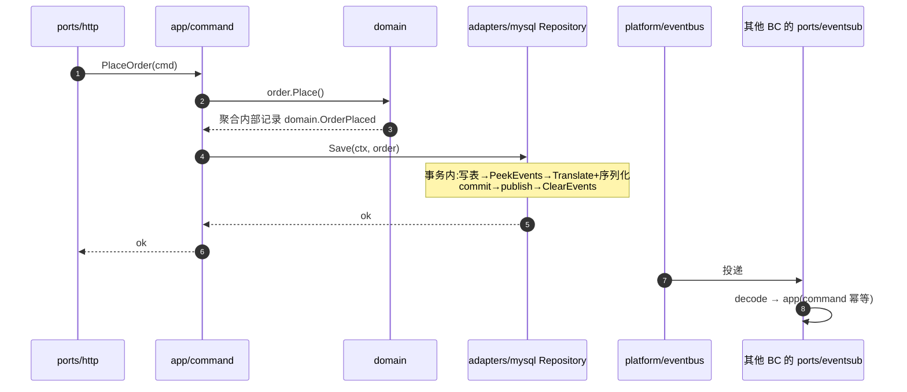

# 跨 Bounded Context 通信

本文档定义 BC 与 BC 之间如何通信、契约如何发布、事件如何流转、事务如何保证一致性。

> 前置阅读:[`architecture.md`](./architecture.md)

## 1. 三种合法的跨 BC 通信方式

| 方式 | 同步/异步 | 入口 | 适用场景 |
|---|---|---|---|
| **Module Contract 直调** | 同步 | 目标 BC 的 `ports/module/contract.go` | **简单低频**查询、必须立即返回结果的命令(如下单时取一次最新单价) |
| **Integration Event 订阅** | 异步 | 目标 BC 的 `ports/module/events.go` + `platform/eventbus` | 最终一致性、解耦协作、跨 BC 副作用 |
| **本地物化视图**(推荐用于高频读) | 异步同步组合 | 调用方订阅发布方的 Integration Event,在本 BC 维护一份精简只读副本 | **高频跨 BC 读**、列表 / 报表 / 搜索 / 详情拼装(见 §5) |

**任何不在此表内的方式都是反例**,见 [`anti-patterns.md`](./anti-patterns.md)。

> **取舍提示**:跨 BC 读不要默认走 module contract——同步链路会让"调用方延迟 = 自己延迟 + 对方延迟",且任何一个 BC 故障会传播。**默认推荐本地物化视图**(§5),只在数据非高频且实时性要求强、又无法离线物化时,才用 module contract query。

## 2. Module Contract:跨 BC 直调

### 2.1 发布方:`ports/module/`

包结构:

```text
ports/module/
├── contract.go   # 接口 + 实现
├── types.go      # transport DTO
└── events.go     # 对外发布的 Integration Event 定义
```

#### `contract.go` 示例

```go
package module

import (
    "context"

    "myshop/internal/shop/app"
)

// ShopModule 是 shop BC 对外暴露的全量进程内能力。
// 调用方在自己的 app/command/services.go 声明只用到的子集接口。
type ShopModule interface {
    GetProduct(ctx context.Context, id ProductID) (ProductDTO, error)
    CheckStock(ctx context.Context, id ProductID, qty int) (bool, error)
    // ... 其它能力
}

type shopModule struct {
    app *app.Application
}

func NewShopModule(app *app.Application) ShopModule {
    return &shopModule{app: app}
}

func (m *shopModule) GetProduct(ctx context.Context, id ProductID) (ProductDTO, error) {
    p, err := m.app.Queries.GetProduct.Handle(ctx, query.GetProduct{ID: id.String()})
    if err != nil {
        return ProductDTO{}, err
    }
    return ProductDTO{
        ID:       p.ID,
        Name:     p.Name,
        Price:    p.Price,
    }, nil
}
```

#### `types.go` 原则

- transport DTO **与 domain entity 解耦**,绝不直接返回 domain 对象
- DTO 字段尽量精简,**只发布外部需要的部分**
- DTO 是稳定契约,字段变更走 [ADR](./adr/README.md)
- 新增字段安全,删除/改语义字段需要 deprecation 流程

### 2.2 调用方:`adapters/{bc}client/`

调用方**不**直接持有 `ShopModule` 接口,而是在自己的 app 层定义最小接口:

#### `order/app/command/services.go`

```go
package command

import "context"

// ProductsService 是 order BC 视角下需要的"商品能力"最小接口。
// 由 order/adapters/shopclient/ 实现。
type ProductsService interface {
    GetProduct(ctx context.Context, id string) (ProductInfo, error)
}

type ProductInfo struct {
    ID    string
    Name  string
    Price int64
}
```

#### `order/adapters/shopclient/products_service.go`

```go
package shopclient

import (
    "context"

    ordercmd "myshop/internal/order/app/command"
    shopmod  "myshop/internal/shop/ports/module"
)

type ProductsService struct {
    shop shopmod.ShopModule
}

func NewProductsService(shop shopmod.ShopModule) *ProductsService {
    return &ProductsService{shop: shop}
}

func (s *ProductsService) GetProduct(ctx context.Context, id string) (ordercmd.ProductInfo, error) {
    dto, err := s.shop.GetProduct(ctx, shopmod.ProductID(id))
    if err != nil {
        return ordercmd.ProductInfo{}, translateErr(err) // 翻译为 order 域错误
    }
    return ordercmd.ProductInfo{
        ID:    string(dto.ID),
        Name:  dto.Name,
        Price: dto.Price,
    }, nil
}
```

### 2.3 接口粒度策略

| 谁定义 | 接口形态 | 原因 |
|---|---|---|
| 发布方 `ports/module/contract.go` | **大接口**,聚合全部能力 | 发布方视角,统一管理 |
| 调用方 `app/command/services.go` | **小接口**,只含用到的方法 | 调用方视角,易于 mock、易于隔离变更 |
| 调用方 `adapters/{bc}client/` | 同时持有发布方大接口 + 实现调用方小接口 | 在边界处做适配 |

这是 Go 隐式接口实现的典型用法,也是 **consumer-driven contract** 的体现。

### 2.4 禁止事项

1. **禁止 module 走 HTTP 自调自**:`shop/ports/module/` 不允许内部 import `ports/http` 客户端发 HTTP 请求到自己。性能、可观测性、循环依赖都会出问题。
2. **禁止跨 BC 直接 import domain / app / adapters**:linter 会拦。
3. **禁止 module contract 直接返回 domain 对象**:必须经 DTO 转换。
4. **禁止 module contract 接收 domain 对象作为参数**:必须接收 transport DTO。

## 3. Integration Event:跨 BC 异步协作

### 3.1 Domain Event vs Integration Event

**两类事件本质不同,目录归属也不同**。

| 维度 | Domain Event | Integration Event |
|---|---|---|
| 目录 | `domain/{aggregate}/events.go` | `ports/module/events.go` |
| 受众 | 本 BC 内部 | 其他 BC |
| 稳定性 | 可以随 domain 演进 | **稳定契约**,字段变更需 deprecation |
| 字段 | 可含聚合内部细节 | 字段精简,只含跨 BC 必要信息 |
| 生命周期 | 聚合产生 | 由 repository 在 Save 后翻译并发布到 eventbus |
| 命名 | `OrderPlaced`、`PaymentConfirmed` | `OrderPlacedV1`、`PaymentConfirmedV1`(带版本) |

### 3.2 事件发布流程



**关键设计**:

1. domain 聚合产生 `domain.OrderPlaced`,暂存于聚合内部(由 `PeekEvents` / `ClearEvents` 访问,见 §3.2)
2. app/command 调 `repo.Save(ctx, aggregate)` 或 `repo.Update{Aggregate}(ctx, id, actor, updateFn)`,**完全不感知 Integration Event 的存在**
3. **`adapters/mysql/{aggregate}_repository.go` 是 Integration Event 翻译与发布的执行点** — 时序见下表(与 [ADR-0006](./adr/0006-transaction-and-outbox.md)、[ADR-0005](./adr/0005-events-internal-vs-integration.md) 一致)
4. 其他 BC 的 `ports/eventsub/` 订阅;**幂等由 app/command 的业务唯一键保证**(§3.5)

#### 发布时序(统一 · 单聚合 `Save` / update closure)

聚合事件 API(实现约定):

- **`PeekEvents() []DomainEvent`**:只读快照,**不清空** — 用于事务内翻译 / 序列化校验
- **`ClearEvents()`**:在 **commit 成功且 publish 全部成功之后**清空
- 新代码**不提供** `PullEvents()`;历史代码如已有 `PullEvents()`,必须标记 `Deprecated`,且 repository / UoW **禁止**调用

`Repository.Save` / `Update{Aggregate}`(无外层 UoW,自管事务)按以下顺序执行:

| 阶段 | 步骤 | 失败后果 |
|---|---|---|
| 事务内 | 1. 对 `Update{Aggregate}`:加载并锁定聚合 → 执行 update closure;对 `Save`:写聚合表 | 回滚;无业务写、无发布;**可**重试同一 `Save` 或整个 update command |
| 事务内 | 2. `PeekEvents()`(不 drain) | 同上 |
| 事务内 | 3. `Translate` + payload 序列化 → 暂存 `[]dbtx.PendingPublish` | 回滚;无业务写、无发布;aggregate 仍持有事件,**可**重试 |
| commit | 4. 提交事务 | `Commit` 返回 error 时结果未知;不 publish,按 unknown commit outcome 处理 |
| commit 后 | 5. 生成 `event_id` → 构造 envelope → `eventbus.Publish`(全部 pending) | publish 失败:业务写已提交;事件仍在 aggregate(见下表) |
| commit 后 | 6. 全部 publish 成功后 `ClearEvents()` | 仅在此步之后进入"事件已从内存清除"状态 |

既有聚合更新优先使用 repository update closure,避免 app 层手写 `FindByID` + mutate + `Save` 时漏掉锁或事务边界:

```go
type Repository interface {
    UpdateOrder(
        ctx context.Context,
        orderID string,
        actor User,
        updateFn func(ctx context.Context, o *Order) error,
    ) error
}
```

接口定义放在 `domain/{aggregate}/repository.go`。`Update{Aggregate}` 内部执行:开启事务 → `SELECT ... FOR UPDATE` 加载聚合 → 调用 `updateFn(ctx, aggregate)` 原地修改聚合 → 写聚合表 → `PeekEvents` / `Translate` / 序列化 → commit → publish → `ClearEvents`。`ctx` 用于取消、超时、trace,**不**携带 `*sql.Tx`;`updateFn` 内只做聚合业务修改,慢外部 IO 应在事务外完成。`updateFn` 返回 error 时回滚,不 publish,不 `ClearEvents`。默认采用 in-place mutate;若某个聚合确需替换实例引用,必须在该 repository 接口单独说明。

#### 失败语义与重试(实现必读)

| `Save` / `Update{Aggregate}` 返回 error 的时机 | 业务写 | 聚合内事件 | 能否复用同一 aggregate / closure 内指针重试 |
|---|---|---|---|
| commit **前**任意步骤 | 未提交 / 已回滚 | 仍在(未 `ClearEvents`) | **可以**:可重试同一 `Save`,或重新执行整个 update command |
| `Commit` 返回 error | 未知 | 仍在(未 `ClearEvents`) | **禁止** — 先按业务 key 查询确认提交结果,再补偿 / 重放 |
| commit **后**、publish 失败 / 部分成功 | 已提交 | 仍在(未 `ClearEvents`) | **禁止** — 会重复写库或重复 publish;应 `FindByID`、补偿或 Outbox |
| `ClearEvents` **后** | 已提交 | 已清空 | **禁止** — 可能已 publish;只能走补偿 / 重放 / Outbox |

> **核心规则**:**commit 成功后**任意 `Save` / `Update{Aggregate}` error(含 publish 失败),或 **`ClearEvents` 已执行**,都**不得**用同一 aggregate 实例再次 `Save`,也不得复用 update closure 内拿到的 aggregate 指针。调用方应 `FindByID` 重建,或把 command 设计为可安全重放的幂等入口。
>
> **Commit 结果未知**:`Tx.Commit()` 返回 error 时,业务写可能已提交也可能未提交。repository **不得 publish**,并应返回可区分的 typed error(如 `CommitOutcomeUnknownError`);上层必须按业务 key 重新查询确认状态,不能把它当成普通可重试错误。
>
> **Post-commit publish 失败不是普通业务失败**:业务写已提交后,若 publish 失败,repository 必须返回 typed error(如 `PostCommitPublishError{Committed: true}`),不能让 HTTP/client/retry middleware 误判为"业务未写入"并自动重试。若某个场景明确选择 best-effort 静默接受,repository 应 log / metric 后返回 nil,而不是返回普通 error。默认推荐 typed error,保留可观测性。
>
> **为何不用 commit 前 drain**:若在事务内 `PullEvents()` 后 Translate 失败,内存事件已丢而 DB 未提交;调用方用同一 aggregate 重试 `Save` 会**再次提交业务状态但不发布事件** — 比 publish 失败更隐蔽。`PeekEvents` 只保证 commit 前步骤的安全重试;`Commit` 返回 error 仍按结果未知处理。

#### 事务错误类型归属

commit outcome unknown 与 post-commit publish failure 是**技术事务语义**,不是 domain error。统一定义在 `internal/platform/txerr`(或等价的 platform persistence 包),供 adapters 返回、app / ports / retry middleware 用 `errors.AsType` 识别;不要定义在 `domain/`,也不要定义在 `adapters/mysql/`(app 不能 import adapter)。

最小形态:

```go
package txerr

type CommitOutcomeUnknownError struct {
    Op  string // 例:"order.Repository.Save"
    Err error
}

func (e CommitOutcomeUnknownError) Error() string { return e.Op + ": commit outcome unknown" }
func (e CommitOutcomeUnknownError) Unwrap() error { return e.Err }

type PostCommitPublishError struct {
    Op        string
    Committed bool // 固定为 true,提示上层业务写已提交
    Err       error
}

func (e PostCommitPublishError) Error() string { return e.Op + ": committed but publish failed" }
func (e PostCommitPublishError) Unwrap() error { return e.Err }
```

app / ports 处理规则:

- `errors.AsType[*txerr.CommitOutcomeUnknownError](err)`:不得自动重试;按业务 key 查询确认提交结果后再补偿 / 重放
- `errors.AsType[*txerr.PostCommitPublishError](err)`:不得当作"业务未写入";返回响应 / 重试策略必须显式体现 `Committed=true`

**为什么翻译放在 repository 而不在 app/command**:

`app/command` 不允许 import `ports/module/`(见 [`architecture.md`](./architecture.md) §5 import 规则)。若把翻译逻辑放 app,会破坏分层。而 repository 作为 adapter,合法 import 自己 BC 的 `domain` + `ports/module`,是 Integration Event 翻译的天然位置。

> **投递保证**:commit **前**用 `PeekEvents`(不 drain),Translate / 序列化失败可回滚且 aggregate 可重试。`Commit` 返回 error 时结果未知,不 publish。**commit 成功后**的 publish 属于 **best-effort** — 进程崩溃、eventbus 关闭等可导致事件丢失(业务写已提交);此时 aggregate 可能仍持有事件(未 `ClearEvents`),但**禁止**复用同一实例 `Save`。本期接受;可靠投递需 Outbox(事务内写发布意向,commit 后 dispatcher 发布)。

#### 翻译函数的所有权

翻译规则(`domain.OrderPlaced → module.OrderPlacedV1` 的字段映射)是契约层的所有权,放在 `internal/{bc}/ports/module/translate.go`:

```go
// internal/order/ports/module/translate.go
package module

import (
    "myshop/internal/order/domain/order"
)

// IntegrationEvent 是翻译函数的强类型输出,含对外契约的类型名和 Body。
// 注意:与 eventbus.Envelope 不同——后者是 bus 流转时的运行时载体(含 event_id、序列化 payload 等)。
type IntegrationEvent struct {
    Type string // 例:"order.OrderPlacedV1"
    Body any    // 对应 V1 / V2 等强类型 struct,由 repository 序列化为 JSON
}

// Translate 把内部 domain event 翻译为对外 integration event。
// 这里集中维护"内部状态 → 对外契约"的映射规则。
func Translate(de any) (IntegrationEvent, bool) {
    switch e := de.(type) {
    case order.OrderPlaced:
        return IntegrationEvent{
            Type: "order.OrderPlacedV1",
            Body: OrderPlacedV1{
                OrderID:  string(e.OrderID),
                UserID:   string(e.UserID),
                Total:    e.Total,
                PlacedAt: e.OccurredAt,
            },
        }, true
    case order.OrderCancelled:
        // ...
    }
    return IntegrationEvent{}, false // 该 domain event 无对应 integration event
}
```

repository 调用 `module.Translate(...)`,对每个有翻译结果的 integration event 暂存为 `dbtx.PendingPublish{EventType: ..., Payload: ..., Source: aggregate}`。事务提交成功后,repository 生成本次投递尝试的 `event_id`(`Deps.IDGen.Next()`),构造 `eventbus.Envelope{EventID, Type, Payload}` 并通过 `platform/eventbus` 发布。全部 pending publish 成功后,按 aggregate 去重并统一调用 `ClearEvents()`。`event_id` 随 envelope 传递到订阅方,用于追踪与排障(§3.3、§3.5)。

### 3.3 event_id 的来源与传递

1. **本期**:由 repository 在每次 publish attempt 前生成 `event_id`(`Deps.IDGen.Next()`),语义是**投递尝试 ID**
2. 通过 envelope 一路传递:**repository → eventbus → 订阅方 handler**
3. **本期**:`event_id` 仅用于追踪、日志关联和排障;**不**作为 dedup 键,也不要求订阅方维护 `processed_events` 表(§3.5)
4. 未来 broker dedup 所需的稳定 `event_id` 必须在 outbox 中持久化生成,不能依赖本期的投递尝试 ID

### 3.4 订阅方:`ports/eventsub/`

```go
// internal/payments/ports/eventsub/order_placed_handler.go
package eventsub

import (
    "context"

    paymentcmd "myshop/internal/payments/app/command"
    ordermod   "myshop/internal/order/ports/module" // 事件 DTO;拆服务后改为独立契约包 import
    "myshop/internal/platform/eventbus"
)

type OrderPlacedHandler struct {
    app *paymentcmd.InitializePaymentHandler
}

func (h *OrderPlacedHandler) EventType() string { return "order.OrderPlacedV1" }

// Handle 接收 envelope(非 DTO):统一入口,携带 event_id 供日志追踪与排障。
func (h *OrderPlacedHandler) Handle(ctx context.Context, env eventbus.Envelope) error {
    var evt ordermod.OrderPlacedV1
    if err := env.Decode(&evt); err != nil {
        return err
    }

    // 幂等由 app/command 保证:InitializePayment 内部以 order_id 唯一约束,
    // 重复投递同一 OrderPlacedV1 不会创建重复支付。
    return h.app.Handle(ctx, paymentcmd.InitializePayment{
        OrderID: evt.OrderID,
        Amount:  evt.Total,
    })
}
```

**所有 eventsub handler 的统一签名是 `Handle(ctx, env eventbus.Envelope)`**,不允许直接接收 DTO。原因:envelope 是 bus 流转的统一载体(含 `event_id`、序列化 payload);handler 在此协议层完成 decode,再委托已幂等的 app/command。

订阅由 `internal/payments/module.go` 装配:`Module.EventSubs` 字段暴露所有 handler(含其声明的 `EventType()`),由 `bootstrap` 统一注册到 `platform/eventbus`。

### 3.5 幂等性

- **订阅方必须幂等**:当前 in-memory eventbus 为 **best-effort** 投递——不提供可靠投递保证;演进到外部 broker + Outbox 后升级为 **at-least-once**,同一事件可能被重发。**无论哪个阶段,重复投递都不能产生副作用**
- **本期策略:业务 command 幂等** — 幂等下沉到 `app/command`,不在 `ports/eventsub/` 引入 `processed_events` 表

每个 Integration Event 订阅的 app command **必须**以稳定**业务唯一键**保证幂等,典型手段:

| 手段 | 示例 |
|---|---|
| DB 唯一约束 | `payments` 表 `UNIQUE(order_id)` — `InitializePayment` 重复调用不插入第二条 |
| 单调条件更新(MySQL 8.0.19+) | 物化视图按业务 key + `version` 单调写入;`ON DUPLICATE KEY UPDATE` **不支持** `WHERE`,用 row alias + `IF(new.version > version, …)` 条件赋值(见下方示例) |
| 显式状态检查 | 聚合已处于目标状态时直接返回 |

物化视图单调更新示例(MySQL):

```sql
INSERT INTO order_product_view (product_id, name, price, version, updated_at)
VALUES (?, ?, ?, ?, ?) AS new
ON DUPLICATE KEY UPDATE
  name       = IF(new.version > version, new.name, name),
  price      = IF(new.version > version, new.price, price),
  updated_at = IF(new.version > version, new.updated_at, updated_at),
  version    = IF(new.version > version, new.version, version);
```

**code review 检查项**:每个 `ports/eventsub/` handler 所调用的 app command,必须能指出其业务幂等键及实现方式。

**`event_id` 的角色(本期)**:发布方仍生成并传递,语义是投递尝试 ID,用于日志、追踪、关联排障;**不作为本期 dedup 键**。若 handler 需要记录日志,使用 `env.EventID` 即可。

**本期不引入 `processed_events` 的取舍**:

| 保留 | 放弃(本期可接受) |
|---|---|
| 实现简单,handler 仅 decode → app | eventsub 层统一 dedup,重复投递会多跑一次 decode/app |
| 业务语义即幂等契约,review 可验证 | 统一 retry / exhausted / poison message 基础设施 |
| 单进程 in-memory 下足够 | broker ack/redelivery 精细语义(当前无 broker) |

> **演进:外部 broker / 多实例阶段** — 当 at-least-once 投递、多 consumer 并发、或需要统一 poison message 停损成为真实需求时,先由 Outbox 持久化生成稳定 `event_id`,再在 `ports/eventsub/` 引入 `processed_events` 幂等占位表(Claim / MarkSucceeded / MarkFailed 状态机),以该稳定 `event_id` 为 dedup 键,与业务幂等形成双层防线。设计细节届时另写 ADR 或补全本节;不在本期实现。

### 3.6 事件版本演进

- 新增字段:直接加,旧订阅方忽略即可
- 删字段 / 改语义:发新版本 `OrderPlacedV2`,保留 V1 直到所有订阅方迁移完成
- 不允许"原地修改"既有事件契约

## 4. 事务与一致性

### 4.1 单聚合写(默认)

- `Repository.Save` **自管事务**,适合新建聚合或调用方已持有聚合实例,完整走 §3.2 时序:`PeekEvents` → commit → publish → `ClearEvents`
- 修改既有聚合时优先用 `Repository.Update{Aggregate}(ctx, id, actor, updateFn)`:repository 在事务内加载并锁定聚合,执行业务闭包,再复用同一发布时序
- app/command 只看到 `repo.Save(ctx, aggregate)` 或 `repo.Update{Aggregate}(ctx, id, actor, updateFn)`,完全不感知 integration event 和 `*sql.Tx`
- **绝大多数 command 应落在此类**

### 4.2 一个 command 改多个聚合(UoW)

- **首选**:重新审视聚合边界 — 两个聚合总被一起改,通常应合并为一个聚合
- **本期约束**:多聚合 command **若会产出 Integration Event**,必须使用 UoW;**禁止**tx-bound repository 在子 `Save` / `Update{Aggregate}` 里 commit / publish(否则外层 UoW 回滚时,事件已发出 → 脏事件)

#### UnitOfWork 接口

每个 BC 在自己的 `app/command/services.go` 定义非泛型接口。闭包参数是该 BC 的 repository bundle,不是全局统一的 repository 集合。

```go
// app/command/services.go
type UnitOfWork interface {
    RunInTx(ctx context.Context, fn func(ctx context.Context, repos Repositories) error) error
}

type Repositories struct {
    Orders order.Repository
    // 只放本 BC 内需要共享同一事务的 repository
}
```

- `context.Context` 只传取消、超时、trace 等请求语义,**不**携带事务对象
- `RunInTx` 闭包内只能使用参数 `repos` 中的 tx-bound repository;不要误用 handler 字段上注入的普通 repository
- `app` 不 import `database/sql`,也不接触 `*sql.Tx`

#### 泛型实现位置

事务模板放在 `internal/platform/dbtx`,用类型参数复用 Begin / Rollback / Commit / commit 后 flush 样板。类型参数 `R` 是某个 BC 自己的 `Repositories` struct。

```go
package dbtx

type RepoFactory[R any] func(tx *sql.Tx, pending *PendingCollector) R

type EventSource interface {
    ClearEvents()
}

type PendingPublish struct {
    EventType string
    Payload   []byte
    Source    EventSource
}

type PendingCollector struct {
    items []PendingPublish
}

func (c *PendingCollector) Append(p PendingPublish)
func (c *PendingCollector) Items() []PendingPublish

type UnitOfWork[R any] struct {
    db     *sql.DB
    build  RepoFactory[R]
    flush  func(context.Context, []PendingPublish) error
    txOpts *sql.TxOptions
}

func (u *UnitOfWork[R]) RunInTx(ctx context.Context, fn func(context.Context, R) error) error
```

`PendingCollector.Append` 由 tx-bound repository 在 `Save` / `Update{Aggregate}` 内调用;`flush` 由 adapter 注入,因为它需要 BC-local 的 `Deps`(如 `EventBus`、`IDGen`、`Translate` 所需上下文)。`dbtx` 只负责事务模板、pending 收集和 commit 后调用 `flush`,不 import 任一 BC 的 `ports/module`。

`adapters/mysql/uow.go` 对平台泛型实现做一层薄包装,返回本 BC 的 `command.UnitOfWork`:

```go
func NewUnitOfWork(db *sql.DB, deps Deps) command.UnitOfWork {
    return dbtx.NewUnitOfWork[command.Repositories](
        db,
        func(tx *sql.Tx, pending *dbtx.PendingCollector) command.Repositories {
            return command.Repositories{
                Orders: NewOrderRepositoryWithTx(tx, pending, deps),
            }
        },
        flushPending(deps),
    )
}
```

普通 repository 由 `*sql.DB` 构造,默认自管事务。tx-bound repository 由 `*sql.Tx` 构造,内部持有同一个事务句柄;repository 方法签名保持 `Save(ctx, aggregate)` / `FindByID(ctx, id)` / `Update{Aggregate}(ctx, id, actor, updateFn)`,不新增 `*sql.Tx` 参数。UoW 内修改既有聚合时仍优先调用 tx-bound `Update{Aggregate}`;它复用外层 `*sql.Tx` 和 `PendingCollector`,**不**自己 Begin / Commit / Publish / `ClearEvents`。只有当 aggregate 已由 tx-bound repository 在同一事务内加载并锁定,或调用方已合法持有该实例时,才在 UoW 内直接调用 `Save`。

#### 多聚合时的事件发布时机

| 场景 | repository `Save` / `Update{Aggregate}` 行为 | 何时 `eventbus.Publish` |
|---|---|---|
| 普通 repository(§4.1) | 自管 tx;§3.2 完整时序 | 本次 repository 方法的 commit 之后 |
| `RunInTx` 内的 tx-bound repo | 仅写表 + `PeekEvents` + `Translate` + 序列化;结果追加到 **UoW 级 pending collector**;**不** commit、**不** publish、**不** `ClearEvents` | **外层 UoW `RunInTx` 成功并 commit 之后**,由平台泛型 UoW 统一 flush,再按 aggregate 去重后 `ClearEvents` |
| UoW `RunInTx` 在 commit 前返回 error | 外层回滚 | **不** publish;aggregate 仍持有事件,可从 DB 重新加载后重试 command |
| UoW `Commit` 返回 error | 提交结果未知 | **不** publish;返回 typed error,上层按业务 key 查询确认后补偿 / 重放 |

```text
Handler.UoW.RunInTx(ctx, fn):
  tx := db.BeginTx(ctx, txOpts)
  pending := PendingCollector{}
  repos := build(tx, &pending)      // repos 内部持有同一个 *sql.Tx
  fn(ctx, repos):
    repos.Orders.Save(ctx, aggA)    → append pending, 不清 aggA 事件
    repos.Xxx.UpdateXxx(ctx, idB, actor, fn)
                                    → append pending, 不清 aggB 事件
                                      // Xxx 代表本 BC 的另一个 repository 字段
  commit tx
  for each p in pending:
    env := Envelope{EventID: IDGen.Next(), Type: p.eventType, Payload: p.payload}
    Publish(env)                  // best-effort;任一失败则返回 typed error,暂不 ClearEvents
  if all ok: for each unique p.aggregate: p.aggregate.ClearEvents()
```

- **若 UoW 内任一 `Save` 在 commit 前失败**:整条 command 回滚,无 publish,各 aggregate 事件仍在 → command 级重试安全(前提是 command 本身幂等)
- **若 UoW commit 返回 error**:不 publish,返回 commit outcome unknown typed error;上层按业务 key 查询确认
- **若 commit 后 flush 部分 publish 失败**:进入 §3.2 post-commit 语义;**禁止**用原 aggregate 实例再次 `Save`
- **UoW 内同一 aggregate 只能 `Save` 一次;`Save` 后不得继续修改 aggregate**。`ClearEvents()` 清的是 aggregate 当前暂存的全部事件,不是 `PeekEvents()` 的快照;重复 Save 或 Save 后继续 mutate 会把未发布的新事件一并清掉
- **丢弃原 aggregate 后,从 DB 重建的新实例不会带出未 `ClearEvents` 的内存事件**。因此 post-commit publish 失败后的补偿 / 重放必须重新执行 command 或走 Outbox,不能指望 `FindByID` 自动恢复原内存事件
- **简化退路(本期可接受)**:若多聚合 command **不需要**对外发 Integration Event,可只做多表写,不注册 `PendingPublish` — 但仍须走 UoW 保证原子性
- **不支持嵌套 `RunInTx`**:需要共享事务的写操作必须放进同一个顶层 `RunInTx` 闭包

> **演进**:多聚合 + 可靠投递 → 事务内写 **outbox 表**(与业务写同事务),UoW commit 后由 dispatcher 读 outbox 发布,替代进程内 `PendingPublish` flush。

### 4.3 跨 BC 一致性

**绝不使用分布式事务**。统一通过 Integration Event 进行最终一致性协作(当前 best-effort 不提供可靠最终一致性保证;可靠保证需引入 Outbox 或等效机制):

- 本 BC:单聚合 `Save` 或 UoW commit 成功后,统一 flush / publish integration event(§3.2、§4.2)
- 跨 BC:订阅方通过**业务 command 幂等**处理(§3.5)
- 当前单进程 in-memory eventbus 下,commit 后在同一进程同步 publish,属于 **best-effort 投递**(commit 后 publish 失败均可能丢事件,本期可接受;不等于可靠 at-least-once)
- 演进到外部 broker 时,可引入 Outbox 模式保证原子性

### 4.4 Saga(可选)

复杂多 BC 协作可引入 Saga,但放在专门的 BC(如 `internal/sagas/`)而不是某个业务 BC 内。本期不展开,待实际遇到再走 ADR。

## 5. 本地物化视图(跨 BC 高频读的默认方案)

跨 BC 查询(如订单列表带商品名)的处理方式按优先级:

| 优先级 | 方案 | 适用 | 风险 |
|---|---|---|---|
| **默认推荐** | 在调用方维护**本地物化视图**,通过订阅 integration event 更新 | **任何高频读、列表 / 报表 / 详情拼装** | 数据延迟(可控,通常秒级);维护成本 |
| 备选 | 走 module contract 暴露 query 方法 | **简单低频**单查(如下单瞬间取最新单价,不能容忍延迟) | 跨 BC 同步耦合 |
| 反例 | 调用方在 app/query 内同步组合多 BC 数据 | 几乎没有 | N+1、延迟叠加、对方故障传播 |

**物化视图实现要点**:

- 物化视图表与本 BC 自己的表放同一个 DB schema,享用同样的事务、备份、监控
- 物化视图通过 `ports/eventsub/` 订阅发布方的 Integration Event 更新,**写入路径与本 BC 业务表一致**(走 `adapters/{persistence}/`)
- query handler 通过 `app/query/read_model.go` 的接口访问物化视图,与"普通"查询代码风格无差异
- 物化视图字段精简,**只放调用方真正用到的部分**——不是对方表的复制

例:order BC 维护 `order_product_view(product_id, name, price, version, updated_at)`,字段比 shop 的 `products` 表精简很多;通过订阅 `shop.ProductCreatedV1` / `shop.ProductPriceChangedV1` 更新。

## 6. 错误翻译

跨 BC 调用必须做错误翻译,**不允许把对方 BC 的 typed error 透传到调用方业务逻辑**:

```go
// adapters/shopclient/products_service.go
import (
    shopdomain "myshop/internal/shop/domain/product" // 禁止!
)
```

正确做法:

- shop 的 `ports/module/contract.go` 把 domain error 翻译为 transport 错误(可以是 typed error 但定义在 module 包内)
- order 的 `adapters/shopclient/` 再把 transport 错误翻译为 order 域错误

## 7. 演进路径下的契约稳定性

两个接口在所有阶段都不变(详见 [`architecture.md`](./architecture.md) §7):

| 接口 | 位置 | Monolith 阶段实现 | Microservices 阶段实现 |
|---|---|---|---|
| 发布方契约:`ShopModule`(全量能力) | `shop/ports/module/contract.go` | 内部调 `shop/app.Application` | HTTP/gRPC server handler |
| 调用方接口:`ProductsService`(最小子集) | `order/app/command/services.go` | `order/adapters/shopclient/` 包装发布方契约 | `order/adapters/shophttp/`(新 adapter)走远端 RPC |

接口签名稳定的硬约束:

- `ShopModule` / `ProductsService` 方法参数**必须能跨进程序列化**(除 `context.Context` 外不能含 Go 特有类型,如 channel、func)
- DTO 字段全部可序列化
- 错误统一用 typed error + 可移植 error code

提前按"这个接口将来要走 RPC"的标准设计,真正拆服务时,domain / app / ports / module.go 一行不动,只是 adapter 实现切换。

## 8. 相关 ADR

- [ADR-0002 Module Contract 模式](./adr/0002-module-contract.md)
- [ADR-0005 Domain Event 与 Integration Event 分离](./adr/0005-events-internal-vs-integration.md)
- [ADR-0006 事务边界与事件发布](./adr/0006-transaction-and-outbox.md)
